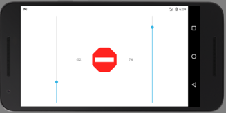

# RobleyRemote

RobleyRemote is an Android app that allows a differential wheeled robot to be steered over Bluetooth.  It is intended for use with a robot running [RobleyVision](https://github.com/SiliconSloth/RobleyVision).

Before compiling the app the value of `LAPTOP_NAME` in [`MainActivity.java`](https://github.com/SiliconSloth/RobleyRemote/blob/master/app/src/main/java/robley/robleyremote/MainActivity.java) must be set to the name of the device running RobleyVision. (It doesn’t actually need to be a laptop, just a device with Bluetooth support.)  I recommend using [Android Studio](https://developer.android.com/studio/) to build the app.

RobleyVision: https://github.com/SiliconSloth/RobleyVision

## Usage

Start `Trainer.py` on the robot before opening the app.  Use the sliders to adjust the powers of the left and right motors.  Press the red stop button to stop the robot and save the training video.

### Acknowledgements

RobleyRemote uses AndroSelva’s [Vertical Seekbar](https://github.com/AndroSelva/Vertical-SeekBar-Android) widget.
